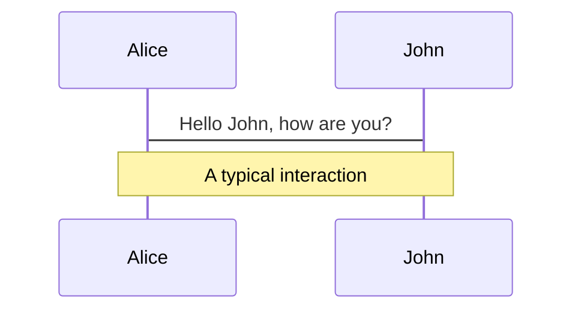
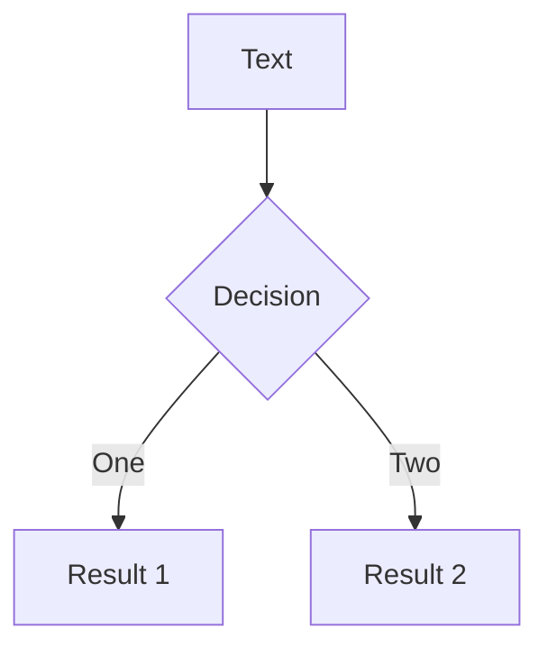

# gRPC

General Overview

<div class="text-sm">
  Made By:
  <ul>
    <li>Steve Bezalel Iman Gustaman 13518018</li>
    <li>Matthew Kevin Amadeus 13518035</li>
    <li>Hengky Surya Angkasa 13518048</li>
    <li>Yonatan Viody 13518120</li>
  </ul>
</div>

<div class="abs-br m-6 flex gap-2">
  <a href="https://github.com/mkamadeus/grpc-demo" target="_blank" alt="GitHub"
    class="text-xl icon-btn opacity-50 !border-none !hover:text-white">
    <carbon-logo-github />
  </a>
</div>

<!--
The last comment block of each slide will be treated as slide notes. It will be visible and editable in Presenter Mode along with the slide. [Read more in the docs](https://sli.dev/guide/syntax.html#notes)
-->

---
layout: cover
title: gRPC
---

# What is gRPC?
General overview of gRPC.

---
layout: quote
---
<div class="italic text-3xl opacity-70">
  "gRPC is a modern open source high performance Remote Procedure Call (RPC) framework that can run in any environment."
</div>

---

# What is gRPC?
Taken from https://grpc.io/

Developed by Google in 2015, here's what they aim for in gRPC:

- 💡 **Simple service definition** - made with Protobuf (https://developers.google.com/protocol-buffers).
- ⚡ **Start quickly and scale** - easy to scale.
- 👨‍💻 **Works across languages and platforms** - generate code for multiple languages.
- ✌ **Bi-directional streaming and integrated auth** - and it uses HTTP/2.0 under the hood.

---

# Where is it used?
Scenarios where gRPC is used, taken from https://grpc.io/

- Interservice communication in a microservices architecture
- Connecting mobile devices and IoT to services
- Generating efficient client libraries

Companies that adopts them:

<div class="flex text-white text-5xl gap-4 items-center mb-4">
  <cib-netflix />
  <cib-cisco />
  <ri-square />
  <ri-coreos-fill />
  <!--  -->
  <div class="italic opacity-50 text-sm">...even Warung Pintar, Xendit, Tokopedia, Gojek</div>
</div>
<div class="italic opacity-50 text-sm">...and many more!</div>


---
layout: cover
title: gRPC
---

# How does gRPC Work?
Using HTTP 2.0 under the hood, let's see how it works.

---

# How does gRPC Work?

Taken from https://grpc.io/docs/what-is-grpc/introduction/

<div class="flex">
  <div class="w-full">
    <ul>
      <li>Basically, it's sending blob via HTTP/2 for requests and responses</li>
      <li>Similar to other RPCs, it can generate stub for each languages</li>
      <li>Marshaling and unmarshaling happens inside the stub</li>
    </ul>
  </div>
  <div class="w-full"></div>
</div>


---
layout: cover
title: gRPC
---

# What's Unique About gRPC?
Some notable things that make it unique from others.

---
layout: cover
title: gRPC
---

# Pros and Cons of gRPC
Things to consider before adopting gRPC.

---
layout: center
---

# Demo Time!
First, let's see how it's used in practice.

<div class="abs-br m-6 flex gap-2">
  <a href="https://github.com/mkamadeus/grpc-demo" target="_blank" alt="GitHub"
    class="flex items-center gap-4 text-xl icon-btn opacity-50 !border-none !hover:text-white">
    <carbon-logo-github />
    <span class="text-xs italic">
    Check out our GitHub Demo.
    </span>
  </a>
</div>

---

# Some steps to follow
Quite similar with other RPCs.

1. **Make your service definition** - achieved by using Protobuf to define your methods and service.
2. **Generate the stub** - using `protoc` and some plugins, generate the code for the required language.
3. **Implement the stub** - implement the methods generated from the stub.

---

# Protobuf Definition Example
Short sample, taken from https://github.com/grpc/grpc-go/blob/master/examples/

```go {all|1|3-8|10-12|14-20}
syntax = "proto3";

option go_package = "google.golang.org/grpc/examples/helloworld/helloworld";
option java_multiple_files = true;
option java_package = "io.grpc.examples.helloworld";
option java_outer_classname = "HelloWorldProto";

package helloworld;

service Greeter {
  rpc SayHello (HelloRequest) returns (HelloReply) {}
}

message HelloRequest {
  string name = 1;
}

message HelloReply {
  string message = 1;
}
```

---

# Generate Stub from Protobuf
Generating Go code, taken from https://github.com/grpc/grpc-go/blob/master/examples/

This command requires `protoc` and `protoc-gen-go` to be installed.
Refer to the documentation for other languages.

```bash {all|2-3|4-5|6}
protoc \
  --go_out=. \
  --go_opt=paths=source_relative \
  --go-grpc_out=. \
  --go-grpc_opt=paths=source_relative \
  helloworld/helloworld.proto
```

---
layout: end
---


---
layout: cover
title: gRPC
---

# What is gRPC?
General overview of gRPC.


---

# Navigation

Hover on the bottom-left corner to see the navigation's controls panel, [learn more](https://sli.dev/guide/navigation.html)

### Keyboard Shortcuts

|                                                    |                             |
| -------------------------------------------------- | --------------------------- |
| <kbd>right</kbd> / <kbd>space</kbd>                | next animation or slide     |
| <kbd>left</kbd> / <kbd>shift</kbd><kbd>space</kbd> | previous animation or slide |
| <kbd>up</kbd>                                      | previous slide              |
| <kbd>down</kbd>                                    | next slide                  |

<!-- https://sli.dev/guide/animations.html#click-animations -->


<p v-after class="absolute bottom-23 left-45 opacity-30 transform -rotate-10">Here!</p>

---

layout: image-right
image: https://source.unsplash.com/collection/94734566/1920x1080

---

# Code

Use code snippets and get the highlighting directly![^1]

```ts {all|2|1-6|9|all}
interface User {
  id: number;
  firstName: string;
  lastName: string;
  role: string;
}

function updateUser(id: number, update: User) {
  const user = getUser(id);
  const newUser = { ...user, ...update };
  saveUser(id, newUser);
}
```

<arrow v-click="3" x1="400" y1="420" x2="230" y2="330" color="#564" width="3" arrowSize="1" />

[^1]: [Learn More](https://sli.dev/guide/syntax.html#line-highlighting)

<style>
.footnotes-sep {
  @apply mt-20 opacity-10;
}
.footnotes {
  @apply text-sm opacity-75;
}
.footnote-backref {
  display: none;
}
</style>

---

# Components

<div grid="~ cols-2 gap-4">
<div>

You can use Vue components directly inside your slides.

We have provided a few built-in components like `<Tweet/>` and `<Youtube/>` that you can use directly. And adding your custom components is also super easy.

```html
<Counter :count="10" />
```

<!-- ./components/Counter.vue -->
<Counter :count="10" m="t-4" />

Check out [the guides](https://sli.dev/builtin/components.html) for more.

</div>
<div>

```html
<Tweet id="1390115482657726468" />
```

<Tweet id="1390115482657726468" scale="0.65" />

</div>
</div>

---

## class: px-20

# Themes

Slidev comes with powerful theming support. Themes can provide styles, layouts, components, or even configurations for tools. Switching between themes by just **one edit** in your frontmatter:

<div grid="~ cols-2 gap-2" m="-t-2">

```yaml
---
theme: default
---
```

```yaml
---
theme: seriph
---
```


</div>

Read more about [How to use a theme](https://sli.dev/themes/use.html) and
check out the [Awesome Themes Gallery](https://sli.dev/themes/gallery.html).

---

## preload: false

# Animations

Animations are powered by [@vueuse/motion](https://motion.vueuse.org/).

```html
<div v-motion :initial="{ x: -80 }" :enter="{ x: 0 }">Slidev</div>
```

<div class="w-60 relative mt-6">
  <div class="relative w-40 h-40">
    
    
    
  </div>

  <div 
    class="text-5xl absolute top-14 left-40 text-[#2B90B6] -z-1"
    v-motion
    :initial="{ x: -80, opacity: 0}"
    :enter="{ x: 0, opacity: 1, transition: { delay: 2000, duration: 1000 } }">
    Slidev
  </div>
</div>

<!-- vue script setup scripts can be directly used in markdown, and will only affects current page -->
<script setup lang="ts">
const final = {
  x: 0,
  y: 0,
  rotate: 0,
  scale: 1,
  transition: {
    type: 'spring',
    damping: 10,
    stiffness: 20,
    mass: 2
  }
}
</script>

<div
  v-motion
  :initial="{ x:35, y: 40, opacity: 0}"
  :enter="{ y: 0, opacity: 1, transition: { delay: 3500 } }">

[Learn More](https://sli.dev/guide/animations.html#motion)

</div>

---

# LaTeX

LaTeX is supported out-of-box powered by [KaTeX](https://katex.org/).

<br>

Inline $\sqrt{3x-1}+(1+x)^2$

Block

$$
\begin{array}{c}

\nabla \times \vec{\mathbf{B}} -\, \frac1c\, \frac{\partial\vec{\mathbf{E}}}{\partial t} &
= \frac{4\pi}{c}\vec{\mathbf{j}}    \nabla \cdot \vec{\mathbf{E}} & = 4 \pi \rho \\

\nabla \times \vec{\mathbf{E}}\, +\, \frac1c\, \frac{\partial\vec{\mathbf{B}}}{\partial t} & = \vec{\mathbf{0}} \\

\nabla \cdot \vec{\mathbf{B}} & = 0

\end{array}
$$

<br>

[Learn more](https://sli.dev/guide/syntax#latex)

---

# Diagrams

You can create diagrams / graphs from textual descriptions, directly in your Markdown.

<div class="grid grid-cols-2 gap-10 pt-4 -mb-6">





</div>

[Learn More](https://sli.dev/guide/syntax.html#diagrams)

---

layout: center
class: text-center

---

# Learn More

[Documentations](https://sli.dev) · [GitHub](https://github.com/slidevjs/slidev) · [Showcases](https://sli.dev/showcases.html)
